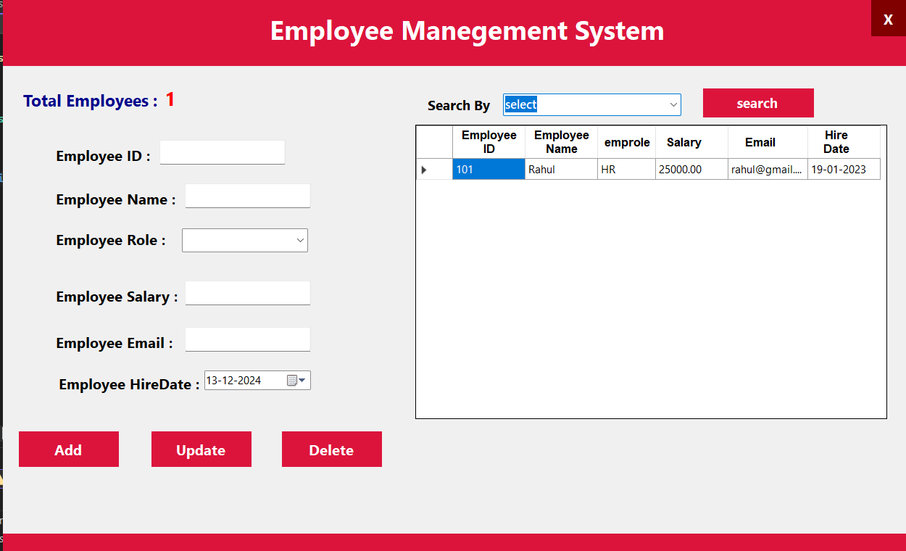

# Employee Management System

## Overview

The **Employee Management System** is a Windows Forms application designed to manage employee data efficiently. It includes features such as displaying employee data based on roles, counting total employees, and providing a user-friendly interface for administrators to interact with the employee database.

## Features

### Display Data Based on Role:
- Fetch and display employee details from the database based on their roles.
- Displays customized column headers and formatting for the DataGridView.
- Shows an informational message if no data is found for the selected role.

### Count Total Employees:
- Displays the total number of employees in the database.
- Hides the display if no employees exist.

### Custom Error Handling:
- Graceful error handling with user-friendly messages for database connectivity issues or unexpected scenarios.

### Responsive UI:
- Dynamically updates the DataGridView and labels as the data changes.

## Technologies Used

- **Programming Language:** C#
- **Framework:** .NET Framework (Windows Forms)
- **Database:** Microsoft SQL Server

## Prerequisites

### Software Requirements:
- Visual Studio (any recent version supporting Windows Forms development)
- Microsoft SQL Server

### Database Configuration:
1. Create a database named `EMPLOYEE_MANAGEMENT_DB`.
2. Create a table named `employee_tbl` using the following script:

```sql
CREATE TABLE employee_tbl (
    empID INT PRIMARY KEY,
    empName NVARCHAR(50),
    empHireDate DATE,
    empSal DECIMAL(10, 2),
    empEmail NVARCHAR(100),
    empRole NVARCHAR(50)
);
```

## Contribution

Feel free to fork the repository, create new branches, and submit pull requests for improvements or bug fixes.

## License

This project is open source and available under the MIT License.
## Screenshot


